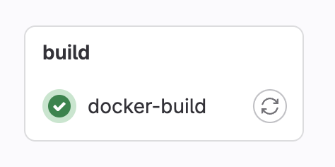

# TME5 : GitLab CI/CD

This TME aims to familiarize you with CI/CD concepts and using GitLab Runner to automate the deployment of a application.

### Part 1: Setup

#### 1. Clone the project

Clone the following project:

```bash
git clone https://github.com/arthurescriou/redis-node.git
```

or if you already have the repository

```bash
git pull origin master
```

#### 2. Configure the GitLab remote

Modify the project's remote to point to your GitLab repository.

```bash
git remote set-url origin https://gitlab.com/<your_username>/redis-node.git
```

#### 3. Create a GitLab Runner with token access

Log in to GitLab:

```bash
gitlab login
```

Enter your GitLab username and password.

```bash
gitlab config set --global url your_gitlab_url
gitlab config set --global personal_access_token your_access_token
```

Replace `your_gitlab_url` with your GitLab instance URL (e.g., https://gitlab.com) and `your_access_token` with a personal access token with sufficient permissions (e.g., "api"). You can create a personal access token with the required scope from your GitLab profile settings.

Register the runner:

```bash
docker run -d --name gitlab-runner --restart always \
  -v /srv/gitlab-runner/config:/etc/gitlab-runner \
  -v /var/run/docker.sock:/var/run/docker.sock \
  gitlab/gitlab-runner:latest
```

You will need to specify some values:

- Your GitLab instance URL : `gitlab.com`
- A runner identification token ( you can generate one on this page : `https://gitlab.com/${yourname}/ci-cd/-/runners/new`)
- A descriptive name for your runner
- A base image for your runner : `node:18-alpine` for instance

If successful, the container will start and you will be able to find it in the gitlab interface.

This will start the runner in the background, allowing it to execute jobs sent by your GitLab instance.

### Part 2 : Pipeline

#### 4.Create the pipeline

Create a `.gitlab-ci.yml` file at the root of the project :

```yml
image: node:18
stages:
  - build
  - test

build:
  script:
    - npm install

test:
  script:
    - npm run test
```

#### Push your changes to GitLab:

```bash
git push
```

The pipeline will be automatically triggered.

And if everything goes well you will see a success execution.



Replace the placeholder with your value:

- `<image_name>`: The name of your image to build and deploy

### Part 3 : Add docker in the pipeline

#### 1.Create a Docker Hub account:

Visit https://hub.docker.com/ and sign up/sign in.

#### 2. Build a docker image in the pipeline

Add a job to build a docker image. (You will also need a `Dockerfile` at the root of the repository.)

```yml
docker:
  script:
    - docker build -t <image_name> .
  rules:
    - if: $CI_COMMIT_BRANCH
      exists:
        - Dockerfile
```

#### 3.Configure image name and authentication

We want now to push our images on docker hube automatically.

Add a docker login step before the docker build and docker push step.

We also need to specify some variables in the secret environment of the repository :

- CI_REGISTRY_USERNAME : your dockerhub username
- CI_REGISTRY_IMAGE : the name of the image
- CI_IMAGE_TAG : the version of the image
- CI_REGISTRY_PASSWORD : your dockerhub password (be sure to put this one in hidden mode)

Add these configuration globally in your `gitlab-ci.yml`.

```yml
variables:
  DOCKER_IMAGE_NAME: $CI_REGISTRY_USERNAME/$CI_REGISTRY_IMAGE:$CI_IMAGE_TAG
before_script:
  - docker login -u "$CI_REGISTRY_USERNAME" -p "$CI_REGISTRY_PASSWORD"
```

And add a new step in your `docker` job.

```yml
- docker push "$DOCKER_IMAGE_NAME"
```

#### 4.Push changes and trigger pipeline:

The pipeline will automatically run due to GitLab CI/CD's push triggers.

### Part 5 : GitLab Pages deployment using:

Clone the react-redis repository and host it with gitlab pages.

#### 1.Activate GitLab Pages:

- Go to your GitLab project settings -> Pages.
- Choose a subdomain or use your root domain.
- Click "Save changes."

#### 2.Create a gitlab-ci.yml file

The gitlab-ci.yml must specify a job that will build the react project and will specify the `build` folder as artifact for gitlab pages.

### Part 6 : Deployment (bonus)

Now that every images are built. How can we deploy it on a kubernetes cluster or on machine with docker ? (from gitlab of course)
