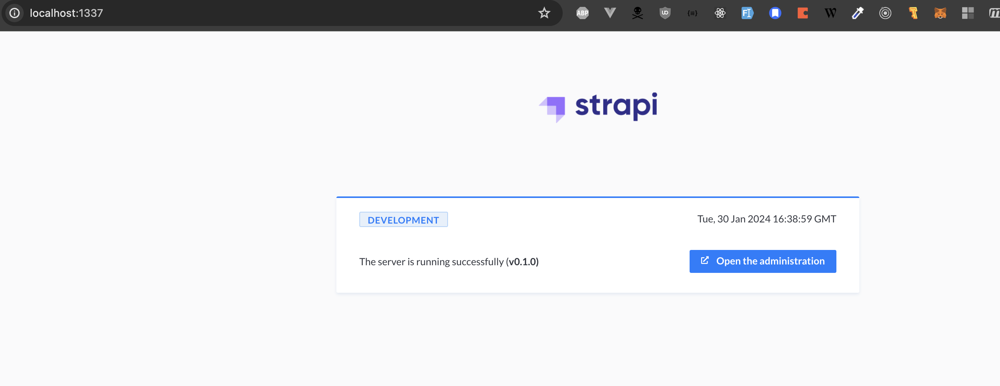
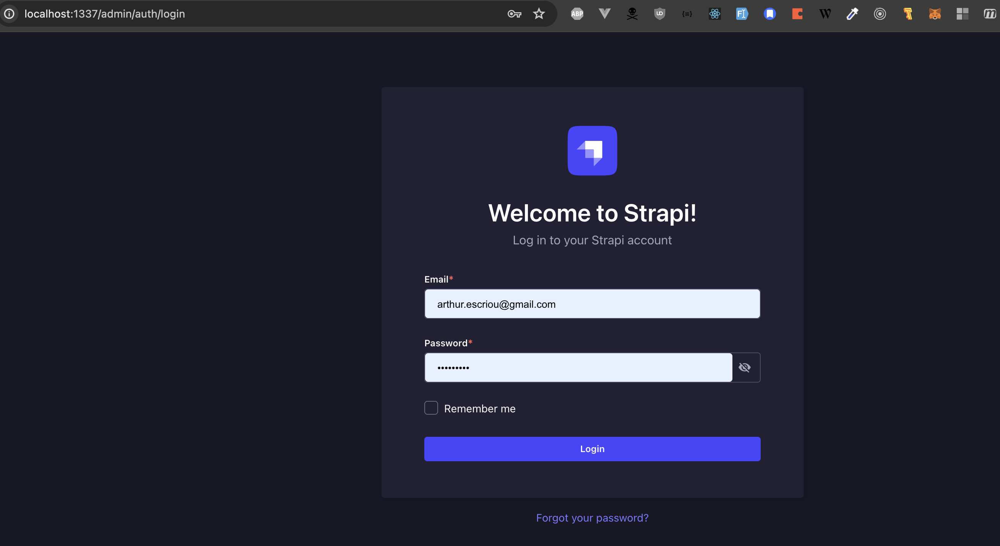
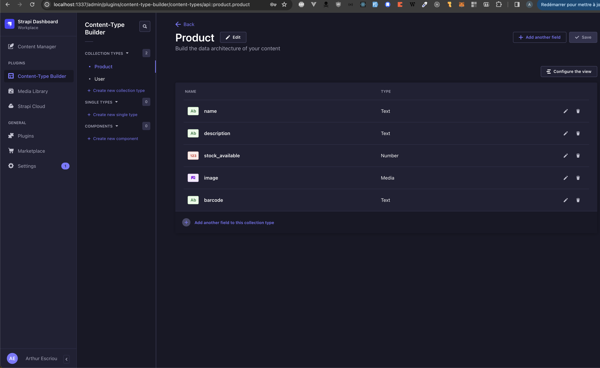
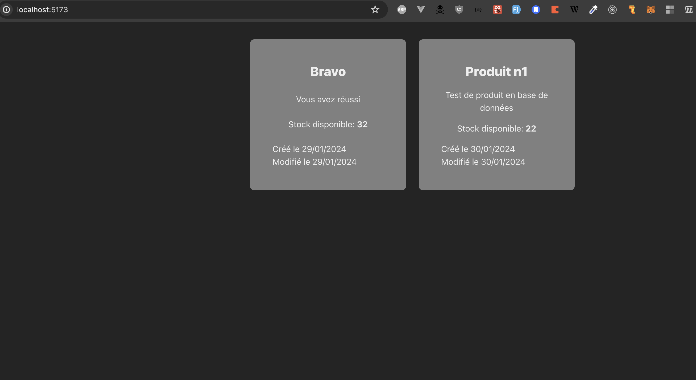

# Projet 1 OPSCI

L'objectif de ce projet est de déployer la première partie de l'infrastructure de OPSCI.

Ce projet est composé de 3 parties pour pouvoir fonctionner :

- strapi : un serveur CMS (content manager system) https://docs.strapi.io/dev-docs/quick-start
- la base de données de strapi (postgresql)
- un frontend web utilisant l'API de strapi : https://github.com/arthurescriou/opsci-strapi-frontend

## Architecture

### Strapi

La première étape pour déployer l'application est de créer un projet strapi.

```sh
yarn create strapi-app ${project-name}
```

Configurez l'application: choisissez le mode avancé et séléctionnez postgresql.

Une fois le projet créé (dans le dossier `project-name`) créez un Dockerfile pour créer une image docker du projet.

Strapi nous fourni une documentation et un exemple de dockerfile : https://docs.strapi.io/dev-docs/installation/docker

Certaines de ces configurations doivent être cohérentes avec celle de la base de données `Postgresql`.

#### Résultat attendu:

Strapi est lancé correctement :


Se connecter avec un administrateur :


Créer la collection `product` :


_Attention! si la collection `product` n'est pas créé ou mal créé le frontend pourrait avoir des erreurs_

##### Product

name: short text
description: long text
stock_available: integer (default 0)
image: single media (only image)
barcode: short text

### Postresql

Pour que Strapi fonctionne il faut lui fournir une base de données.

Pour déployer cette base de données nous allons utiliser docker.

Il y a quelques configuration à ajouter pour être sur de correctement initialiser la base de données :

`POSTGRES_PASSWORD` et `POSTGRES_USER`

Que l'ont peut communiquer à l'image postresql de cette façon :

```sh
docker run -dit -p 5432:5432 -e POSTGRES_PASSWORD=safepassword -e POSTGRES_USER=strapi --name strapi-pg postgres
```

_NB: par défaut une base postresql expose ses services sur le port 5432. Libre à vous de modifier cette configuration si besoin._

### React

En addition avec le frontend administrateur de strapi un projet react vous est fourni et doit se connecter à l'API de strapi.

Vous devez récupérer le code : https://github.com/arthurescriou/opsci-strapi-frontend.

Vous devez également configurer ce frontend et le compiler/minifier (cf readme).

_NB: pour se connecter à l'API de strapi, outre l'URL correct, il faut ajouter un `TOKEN` de sécurité. Il est possible de générer ce token dans l'interface administateur. (https://docs.strapi.io/dev-docs/configurations/api-tokens)
Il faudra l'ajouter dans la configuration du frontend._

Résultat attendu (les deux élèments sont des produits créé dans strapi):



## Travail attendu

L'objectif de ce projet est de créer toute l'application décrite ci-dessus.

Chacun des ces éléments devra être déployé à partir d'une image docker sur l'infrastructure fourni par l'UE.

Vous devrez configurer correctement les conteneurs pour qu'ils interagissent entre eux.

#### Rendu attendu :

- Un dépôt git accessible en ligne comportant tous les fichiers que vous avez écrit (Dockerfile, script shell, etc).

Veillez bien à sauvegarder dans des fichiers toutes les commandes que vous allez lancer dans l'objectif de déployer l'application.

- Le dépôt git devra aussi comporter un `readme.md` référencant l'endroit ou est déployé votre application (adresse IP, nom de machines).

  Ainsi que les endpoints nécessaire à son utilisation : adresses et ports de tous les éléments de l'application.

- Vous pouvez ajouter tout éléments supplémentaires qui vous semble utile à votre rendu (screenshot, logs, etc).

### Groupe

Ce projet ce fera en binôme. Veillez bien à spécifier vos numéros étudiants dans le `readme.md`.

La date de rendu limite est le **10 mars 2024 à 23h59**.

(Les dates de commit faisant foi, tout rendu ultérieur sera sujet à pénalitées).

L'instabilitée dans le temps de votre application ne sera pas pénalisé.
