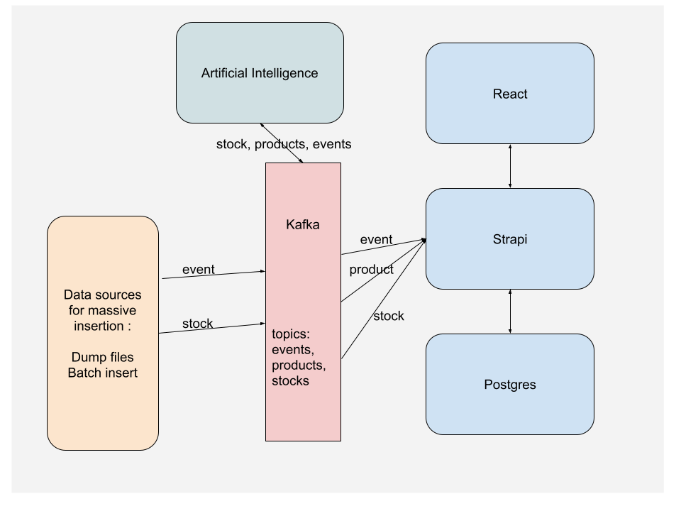

# Projet OPSCI: Architecture évènementielle

Ce projet à pour objectif d'ajouter des éléments évènementiel à aux éléments créés dans le premier projet.

## Prérequis

Pour facilier le lancement du premier projet vous pouvez utiliser ce docker-compose, ou directement votre travail.

Si vous utilisez votre travail il faudra modifier le type de `product` :
Ajouter un champs `status` de type `enumeration` : `safe|danger|empty`

Et créer un type event avec un champ `value` de type `string` et un champ `metadata` de type `JSON`.

Le projet initialise les formats des objets nécessaire au projet 2. Il peut être nécessaire de regénérer un API TOKEN.

```yaml
version: '3'
services:
  strapi:
    container_name: strapi
    image: arthurescriou/strapi:1.0.0
    restart: unless-stopped
    env_file: .env
    environment:
      DATABASE_CLIENT: ${DATABASE_CLIENT}
      DATABASE_HOST: strapiDB
      DATABASE_PORT: ${DATABASE_PORT}
      DATABASE_NAME: ${DATABASE_NAME}
      DATABASE_USERNAME: ${DATABASE_USERNAME}
      DATABASE_PASSWORD: ${DATABASE_PASSWORD}
      JWT_SECRET: ${JWT_SECRET}
      ADMIN_JWT_SECRET: ${ADMIN_JWT_SECRET}
      APP_KEYS: ${APP_KEYS}
      NODE_ENV: ${NODE_ENV}
      PORT: 8080
    ports:
      - '8080:8080'
    networks:
      - strapi
    depends_on:
      - strapiDB

  strapiDB:
    container_name: strapiDB
    restart: unless-stopped
    env_file: .env
    image: arthurescriou/strapi-pg:1.0.0
    environment:
      POSTGRES_USER: ${DATABASE_USERNAME}
      POSTGRES_PASSWORD: ${DATABASE_PASSWORD}
      POSTGRES_DB: ${DATABASE_NAME}

    ports:
      - '5432:5432'
    networks:
      - strapi

networks:
  strapi:
    name: Strapi
    driver: bridge
```

## Architecture

On souhaite créer un système permettant d'intégrer de grande quantité de données venant de différents flux avec beaucoup de résilience à l'erreur.

Pour ça on utilise un message broker: Kafka.



### Kafka

On veut lancer un kafka avec docker (ou kubernetes).

On utilise la même solution qu'au TME7.

```yml
version: '3'
services:
  zookeeper:
    image: wurstmeister/zookeeper
    ports:
      - '2181:2181'
  kafka:
    image: wurstmeister/kafka
    ports:
      - '9092:9092'
    environment:
      KAFKA_ADVERTISED_LISTENERS: INSIDE://kafka:9093,OUTSIDE://localhost:9092
      KAFKA_LISTENER_SECURITY_PROTOCOL_MAP: INSIDE:PLAINTEXT,OUTSIDE:PLAINTEXT
      KAFKA_LISTENERS: INSIDE://0.0.0.0:9093,OUTSIDE://0.0.0.0:9092
      KAFKA_INTER_BROKER_LISTENER_NAME: INSIDE
      KAFKA_ZOOKEEPER_CONNECT: zookeeper:2181
    volumes:
      - /var/run/docker.sock:/var/run/docker.sock
```

### Topics

Notre kafka va nécéssiter plusieurs topics :

- product : un topic dédié à la création de nouveau produit en masse, venant de différentes sources
- event : un topic dédié à la création de nouveau produit en masse, venant de différentes sources
- stock : un topic pour enregistrer et appliquer tous les mouvements de stocks de nos produits
- error : pour récupérer les évènement ayant abouti à une erreur diverse

_Attention tous ces topics devront être précisés dans les configurations des consumers et producers. Si le noms n'est pas le même des deux cotées la communication ne marchera pas._

### Consumer et Producer

Pour utiliser ces topics plusieurs élèments sont à votre disposition sous la forme d'image docker ou de dépôt github (https://github.com/orgs/opsci-su/repositories).

Il s'agit des consumers et producers pour les différents éléments.

#### product-producer

https://hub.docker.com/repository/docker/arthurescriou/product-producer/

#### product-consumer

https://hub.docker.com/repository/docker/arthurescriou/product-consumer/

#### event-producer

https://hub.docker.com/repository/docker/arthurescriou/event-producer/

#### event-consumer

https://hub.docker.com/repository/docker/arthurescriou/event-consumer/

#### stock-producer

https://hub.docker.com/repository/docker/arthurescriou/stock-producer/

#### stock-consumer

https://hub.docker.com/repository/docker/arthurescriou/stock-consumer/

#### artificial-intelligence

_TBA_
