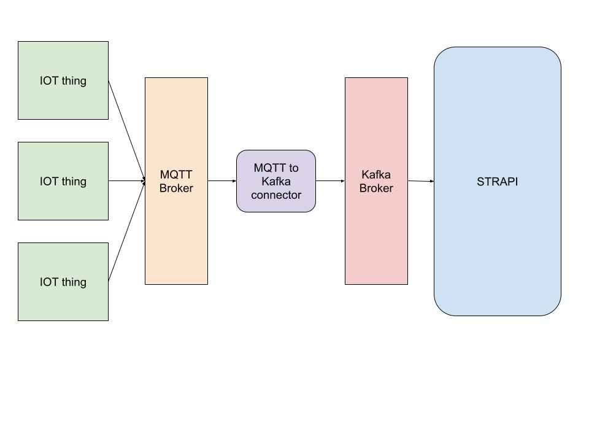

# TME 10 - 11 OPSCI: Internet des objets

Ce projet à pour objectif d'ajouter la gestion d'objets connectés dans l'architecture créé dans les deux premiers projets.

## Prérequis

Pour ce projet on a besoin de l'architecture évènementiel car on va créer des producteur "IoT" pour le kafka.

Il faut donc un kafka fonctionnel avec un strapi pour consommer les données.

## Architecture

On souhaite créer un système récupérant des données provenant du "terrain". Cependant on ne peut pas exposer notre kafka à l'extérieur de notre data center pour des raisons de sécurité.

On va donc passer par un autre message broker pour communiquer avec nos client "IoT".



### MQTT

On veut lancer un broker MQTT.

Pour ça on va utiliser <a href="https://mosquitto.org/">Mosquitto</a>, une implémentation open source de MQTT.

On peut le lancer facilement avec <a href="https://hub.docker.com/_/eclipse-mosquitto" >l'image officielle </a>.

Il suffit de créer un fichier `mosquitto.conf` et de le lier avec un volume. (voir la doc officielle pour l'emplacement du fichier dans le conteneur)

```
#mosquitto.conf
persistence true
persistence_location /mosquitto/data/
log_dest file /mosquitto/log/mosquitto.log
allow_anonymous true
listener 1883
protocol websockets
```

Une fois le conteneur lancé on peut se connecter dessus avec client `mqtt` sur le port 1883.

Vous pouvez utiliser ces <a href="https://github.com/arthurescriou/mqtt-js-test">scripts</a> pour tester votre broker mosquitto.

_NB: On utilise ici des websocket en protocole car on veut communiquer avec un navigateur (qui ne gère pas nativement le protocole MQTT qu'on va encapsuler dans une websocket).
Pour ça on devra utiliser des URL `ws://url` et non `mqtt://url`._

### Connecteur MQTT to Kafka

Il nous faut un élément qui fait le lien entre le broker MQTT et le broker Kafka.

Pour ça vous devez déployer un conteneur pouvant communiquer avec les deux :

<a href="https://hub.docker.com/repository/docker/arthurescriou/mqtt-kafka-connector/general"> https://hub.docker.com/repository/docker/arthurescriou/mqtt-kafka-connector/general </a>

Variable d'environment par défaut :

```sh
BROKER_1='localhost:9092'
BROKER_2='localhost:9092'
BROKER_3='localhost:9092'
KAFKA_TOPIC='stock'

MQTT_TOPIC='topic'
MQTT_ENDPOINT='ws://localhost:1883'
```

### Client web

Vous pouvez tester de modifier un stock depuis un <a href="https://mqtt-test-front.onrender.com/" >frontend</a> (veillez à configurer correctement dans le formulaire).

## Rendu attendu :

- Une vidéo de démonstration type **screencast** , qui parcours les différentes fonctionnalitées de l'application déployée. (Montrez toute la chaine de modification de stock: front -> MQTT -> kafka -> strapi).

- Un dépôt git accessible en ligne comportant tous les fichiers que vous avez écrit (Dockerfile, script shell, etc).

### Groupe

Ce projet ce fera en binôme. Veillez bien à spécifier vos numéros étudiants dans le `readme.md`.

La date de rendu limite est le **13 avril 2025 à 23h59**.
